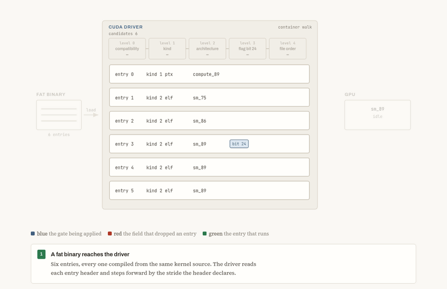

# CUDA fat binary entry precedence

A CUDA fat binary holds several compiled forms of the same GPU code. The driver
picks exactly one and runs it, by a rule NVIDIA does not publish.

Watching what ran is a solved problem, and dynamic instrumentation is the right
tool for it. CUPTI reports the selected payload back to a profiler on live
hardware, and eBPF probes spanning the CUDA API see containers as they load and
the calls that follow them. The open question is the one before execution:
**given the file, which entry will run**. That is what a scanner reading a
wheel in a registry has to answer, what an attestation mapping observed code
back to a shipped entry has to answer, and what anyone reasoning about a GPU
they do not have in front of them has to answer. None of it can be settled by
running the code.

NVIDIA documents the coarse rule, that a compatible cubin is preferred over
PTX, and then stops: the runtime is said to find the "best matching" entry,
with no statement of what happens when several entries match equally well.
Every finding below lies beneath that line.

Every one of them is implemented in `scripts/fatbin_entry_selection.py`, which
names the entry the driver would run from the file alone, taking the target
architecture and the host policy as arguments rather than assuming the local
machine. It agrees with the hardware on all 41 measured cases, so the question
can be answered without a GPU to answer it on.

## What the driver actually does

| # | Finding | Evidence |
|---|---|---|
| 1 | Selection is a hierarchy: compatibility filter, then kind, then architecture proximity, then flag bit 24, then file order | [entry-precedence](analysis/entry-precedence.md) |
| 2 | File order reverses by kind: the **first** cubin wins, the **last** PTX wins | [entry-precedence](analysis/entry-precedence.md) |
| 3 | Flag bit 24 breaks a cubin tie, and the entry **without** it wins | [entry-precedence](analysis/entry-precedence.md) |
| 4 | Flag bits 20 and 21 encode the `a` and `f` architecture-name suffix; the driver matches on the rendered name `sm_<arch><suffix>` | [driver-selection-logic](analysis/driver-selection-logic.md) |
| 5 | Architecture is declared twice; selection reads the entry header, validation reads the embedded ELF, in that order | [entry-precedence](analysis/entry-precedence.md) |
| 6 | Selection commits: a refused payload does not fall back to a good entry sitting next to it | [entry-precedence](analysis/entry-precedence.md) |
| 7 | Nothing validates payloads; a two-byte edit inside compiled SASS loads and runs | [driver-selection-logic](analysis/driver-selection-logic.md) |
| 8 | Flag bit 16 marks obfuscation; the key sits in the entry header and the transform is reversible from the file alone | [ptx-obfuscation](analysis/ptx-obfuscation.md) |
| 9 | `--okey` collides two inputs through a decimal-to-hex round trip, leaving well under 32 bits of key space | [ptx-obfuscation](analysis/ptx-obfuscation.md) |
| 10 | Decompression is keyed by a flag bit rather than by entry kind, and the decompressed size is not where format notes place it | [driver-selection-logic](analysis/driver-selection-logic.md) |
| 11 | Entry kinds 0x20, 0x80 and 0x100 are `index`, `tile ir` and `contatenated entry`, NVIDIA's own spelling | [fatbin-entry-kinds](analysis/fatbin-entry-kinds.md) |
| 12 | Kind 0x10 is an ELF the driver finalizes before load. **Inference**, not confirmed: NVIDIA names it nowhere | [fatbin-entry-kinds](analysis/fatbin-entry-kinds.md) |
| 13 | `payload_size` advances the walk but does not bound the read: PTX is read to the first NUL, an ELF to the extent its own headers describe. Two containers declaring byte-identical payloads run different kernels | [declared-versus-executed](analysis/declared-versus-executed.md) |
| 14 | `fat_size` is truncated to a signed 32-bit value, and an entry is walked when its **start** is inside it, so an entry lying outside the declared container executes | [declared-versus-executed](analysis/declared-versus-executed.md) |

The illustration below shows rows 1 to 3 as the driver applies them, one
container narrowed to one kernel:



Six entries compiled from one kernel, and five are dead before the GPU sees
anything. Each gate crosses out the entry it rejects and marks the field that
did it: the wrong cubin generation, the kind that outranks it, the further
architecture, the flag bit, the file position. Entry 4 survives and runs.

That container is real, and it is in the corpus as `six_entry.fatbin`.
Clearing bit 24 on entry 3 changes the marker the GPU returns from `0xBBBB` to
`0xAAAA`, because entry 3 then wins on file order instead. Nothing else in the
file changes, and both containers are built by `make -C src/kernels` and
measured the same way as every other row.

Open [docs/entry-selection.html](docs/entry-selection.html) for the same
walkthrough with a pause control, or
[docs/entry-explorer.html](docs/entry-explorer.html) to edit the entries and
flag bits yourself and watch the rule decide.


+ [SELECTION-RULE.md](SELECTION-RULE.md) is the whole argument read end to end.
+ [declared-versus-executed](analysis/declared-versus-executed.md) is the
sharpest single result: two containers whose declared payload bytes are
byte-identical, running different kernels on the GPU.
+ What was already
public before this work is set out in [prior-art](analysis/prior-art.md).
+ The selection path is given as disassembly in
[driver-selection-logic](analysis/driver-selection-logic.md) and as decompiled
C in [decompiled-selection](analysis/decompiled-selection.md). 

## This is not only a laptop result

The measurements were taken on a laptop GPU, but the same selection code ships
in NVIDIA's Linux **data center** driver, the branch validated for HGX
A100/A800, H100 and H800. Confirmed by static comparison against
`libcuda.so.610.57.04`: the architecture-name rendering including both suffix
bits, the flag bit 24 tie-break, the kind cascade, the TileIR dispatch through
`libnvidia-tileiras.so` and the obfuscation path all appear there in the same
shape.

Two limits, stated plainly. Nothing was executed on that driver, since no data
center hardware was available, so this is static evidence that the code is
present rather than a measurement that it behaves identically. And that build
carries additional selector policies absent from the laptop driver, including
one that reorders the kind hierarchy, so behaviour under those policies is
uncharacterised.

## Why it matters

Selection only matters when a container holds more than one candidate, and it
almost always does: **339 of the 343** fat binaries in the CUDA toolkit's own
shipped libraries carry more than one entry. Any tool reading GPU code out of a
binary therefore has to decide which entry it is reading, on nearly every file
it meets.

Nothing in the container answers that for it, and no tool that reads the file
does either. `cuobjdump` lists every entry with nothing marking which one the
driver would run. It reports a different architecture for the same entry through
`-lelf` than through `-elf`. And for an obfuscated entry it prints "No PTX file
found to extract", which reads like an entry with no PTX rather than one whose
PTX it could not decode. Those are measurements of NVIDIA's own tools.

It takes no crafted file to reach this. An ordinary `nvcc -arch=sm_89 -c`
already emits a container whose PTX entry can never run on the GPU it was built
for, and nothing in the output says so.

Knowing the rule is what closes the gap. A tool that reproduces the driver's
precedence can point at the entry that will actually execute, hash that one,
disassemble that one, and say plainly when a container has no runnable entry at
all. That is what `would_execute()` does, and
[divergence-matrix](analysis/divergence-matrix.md) is how it was checked: 40
containers built to put the rules in conflict, measured as 41 cases because one
is loaded under two host policies, each one run on a real GPU, with the rule
agreeing with hardware on every one.

## Where this shows up

Running models locally is ordinary now, and the weights are the safe part: a
safetensors or GGUF file is data, and loading it executes no device code. What
executes is everything around it. The packages that run the model ship compiled
GPU code inside their wheels, and `trust_remote_code=True` lets a model
repository build and load its own. That is a supply chain where the realistic
attacker is one who can ship a binary, and it is the threat model these
findings sit in.

Nothing here is an attack on that supply chain, and none was demonstrated. The
point is narrower: anything built to scan, hash or attest GPU code has to
answer which entry actually runs, and which bytes are that entry, before it can
claim to have looked at the code. Neither question is answered by the fields
that appear to answer them: two containers declaring byte-identical payloads
run different kernels here, measured on the GPU.

## What already exists, and where it stops

Worth being precise about, since two mechanisms partly cover this ground.

**CUPTI answers it at runtime.** A profiler subscribing to
`CUPTI_CBID_RESOURCE_MODULE_LOADED` receives the payload the driver selected,
not the container. Measured here: loading a 6368-byte container holding two
sm_89 cubins hands back 3112 bytes, a bare ELF, carrying only the winning
kernel's marker, and it tracked the driver on every case tried. So "what ran"
is available, officially, on a host you control while it runs.

Two things it does not give. It needs the code to execute, which a registry
scan cannot do. And it returns compiled SASS without provenance: a 640-byte
PTX-only container yields a 3112-byte ELF that appears nowhere in the input, so
mapping observed code back to a shipped entry still needs the rule.

**eBPF instrumentation is better placed than any file reader.** Stealthium's
platform, whose write-up of the fatbin format this research started from,
intercepts several CUDA APIs in real time with eBPF uprobes, `cuModuleLoadData`
among them, capturing the complete fatbin, the process context, every contained
PTX and cubin, hashes of the individual kernels, the architecture targets and
toolkit versions, and the compression and binary metadata. Capturing the
container already beats reading a file section, since it catches containers
assembled on the heap. And a hook set that reaches past the load is not
confined to the container: selection happens inside `libcuda` after the load,
so what follows it in the API is where the answer becomes visible, which is a
vantage point no static reader has.

What it costs is what CUPTI costs. The code has to execute, on a host you
control, while it runs, so a file sitting in a registry is out of reach. And
the published account of the rule itself is still the coarse two-tier one,
matching SM version else PTX, so predicting the selection before execution, or
mapping an observed kernel back to the shipped entry it came from, still needs
the precedence rule set out above.

**No tool that reads the file models the selection.** Three real ones were run
against the same containers. None of them is a security control, and that
should be said before the table rather than after it: Datadog's parser is GPU
observability, where a mis-parse costs a metric and not a gate; ZLUDA is a
compatibility layer; `cuobjdump` is an inspection utility that lists entries
and never claims to choose between them. They are here because they are the
real, named, open-source instances of the pattern a scanner would be built
from.

| Container, on an sm_89 GPU | `cuobjdump` | Datadog `pkg/gpu/cuda` | ZLUDA | fatbin_entry_selection.py | the GPU ran |
|---|---|---|---|---|---|
| sm_80 and sm_86 cubins, stock `nvcc` output | lists both, marks neither | no kernels found | nothing, discards cubins | entry 1 | entry 1 |
| compute_89 PTX then sm_89 cubin | lists both | entry 1, **correct** | entry 0, the PTX | entry 1 | entry 1 |
| two compute_89 PTX entries | lists both | no kernels found | entry 1, **correct** | entry 1 | entry 1 |

Each tool is right once and blind twice, and none of them is right for a
reason that generalises. Datadog drops PTX unconditionally, which happens to
agree with the driver preferring cubins on row two and fails on row three.
ZLUDA keeps only PTX and walks it backwards, which happens to match the
last-PTX-wins rule on row three and fails on row two.

Row one is the one to weigh, because nothing in it is crafted. Two stock
cubins, the shape cuBLAS actually ships, and the tool reports no kernels at all
while the GPU runs one. Its filter matches the raw compute capability with no
compatibility range, so a container with no exact match disappears. ZLUDA's
source says the rest: it discards every cubin with
`if file.header.kind != HEADER_KIND_PTX { return; }`, then walks PTX in reverse
behind a literal `// TODO: actually sort by SM`. The rule is not merely
undocumented, it is unimplemented outside NVIDIA.

Every cell above was measured, the tools built from pinned upstream commits and
run locally, with the last column read back from the GPU. `tools/fetch.sh`
clones both upstreams at those pins and builds a thin probe against each
parser; `tools/run.sh` reproduces the table. Neither probe reimplements any
parsing, and [tools](tools/README.md) says what each one does and does not
cover. No evasion of a
security product is claimed, because no open-source GPU-code security scanner
was found to test against.

For contrast, Apple ships `macho_best_slice()` precisely so tools can ask which
slice of a universal binary will run, and Patrick Wardle showed in 2024 that
where it disagrees with the loader, scanners can be evaded. CUDA has no
equivalent call.

## What the parser adds

`scripts/fatbin_entry_selection.py` answers the question the format does not:
for each entry, whether the driver would execute it.

- **It can answer "nothing runs."** A first-match scanner structurally cannot
  produce that verdict, yet it is the correct answer for three container shapes
  here.
- **It takes the target and the host policy as arguments**, so `sm_90a` and a
  `CUDA_FORCE_PTX_JIT` host are parameters rather than separate code paths.
- **It hashes the decompressed payload**, so identical device code cannot hash
  differently merely because a compression setting changed.
- **It hashes the extent the driver reads**, not the declared payload, which is
  what stops two containers with byte-identical declared bytes from hashing the
  same while running different kernels.
- **It walks the container the way the driver does**, with `fat_size` truncated
  to a signed 32-bit value and an entry counted as present when its start is
  inside, so entries that lie outside the declared container are not missed.
- **It decompresses on the flag, not the kind**, which is what stops compressed
  cubins from being read as garbage.
- **It flags an architecture disagreement** between the entry header and the
  embedded ELF, a field `cuobjdump` reports inconsistently across its own two
  modes.
- **It reports an obfuscated entry as a distinct outcome**, not as an entry
  with no code, which is how the shipped tooling presents it.

All 343 shipped containers parse with no structural complaint, so it is
exercised on real code and not only on its own corpus. That includes one PTX
entry in `libcufile` compressed with LZ4 rather than zstd: the flags field
carries a compression family, named in Stealthium's published `BinInfo` enum,
and a parser that keys on the zstd bit alone hashes 3061 bytes of compressed
data in place of 10879 bytes of PTX.

## Reproducing

Needs a CUDA toolkit, a supported GPU, and Python with `pyelftools` and
`zstandard`.

```sh
make -C src/kernels                  # cubins, PTX, and the corpus containers
make -C src/harness                  # the loader
python3 scripts/divergence_matrix.py # the matrix, measured against the GPU
python3 scripts/survey_libs.py       # the same question on shipped libraries
python3 scripts/fatbin_entry_selection.py build/ptxa_elfb.fatbin
```

To reproduce the tool comparison as well, which needs `cargo` and `go`:

```sh
./tools/fetch.sh                     # clone ZLUDA and the Datadog agent at the pins
./tools/run.sh                       # every reader over the same containers
```

Set `CUDA_CACHE_DISABLE=1` for any manual run, or a cached JIT result can be
mistaken for a fresh selection decision. The matrix script sets it itself.

## Layout

```
SELECTION-RULE.md   the argument end to end
docs/               the selection walkthrough as a GIF and as two live pages
analysis/           the evidence behind each finding above, size fields included
scripts/            the selector, the divergence matrix, the library survey
src/                test kernels and a minimal Driver API loader
probes/             programs that identify entry kinds via libnvfatbin
tools/              thin probes over the Datadog and ZLUDA parsers, at pinned commits
```

## Scope

NVIDIA RTX 2000 Ada Generation Laptop, compute capability 8.9, driver 597.06,
CUDA 13.2, Ubuntu 22.04 under WSL2. Every measurement is conditional on that.
The driver reverse engineering was done on the same build, so both halves agree
on version, and the addresses are build-specific: they will not survive a
driver update.

No selection behaviour here is a driver vulnerability. The driver applies its
own rule correctly and consistently; the gap is between that rule and the one a
convenient static reading uses, and it lives in the tooling. Every payload in
this repository writes a marker value and nothing else.
